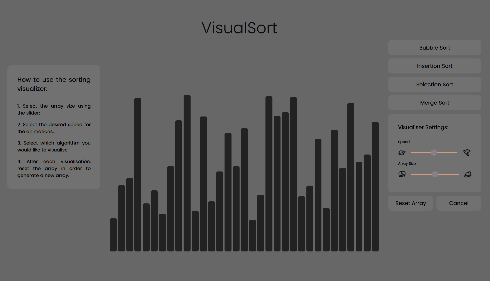

# Sorting Algorithms Visualiser

### Live version of the app: 
#### https://visualgosort.netlify.app/

### Application created to assist with understanding how some sorting algorithms work.

### Currently comprises of 4 algorithms:
#### - Bubble Sort
#### - Insertion Sort
#### - Selection Sort
#### - Merge Sort

### Algorithms that will be implemented in the near future:

#### - Quick Sort
#### - Radix Sort

### Application created using React. Feel free to fork it and make your own version of it!

### After forking the repository, run:
#### `npm start`
Runs the app in the development mode.\
Open [http://localhost:3000](http://localhost:3000) to view it in your browser.

###### Special thanks to the people at Visualgo for inspiration!

